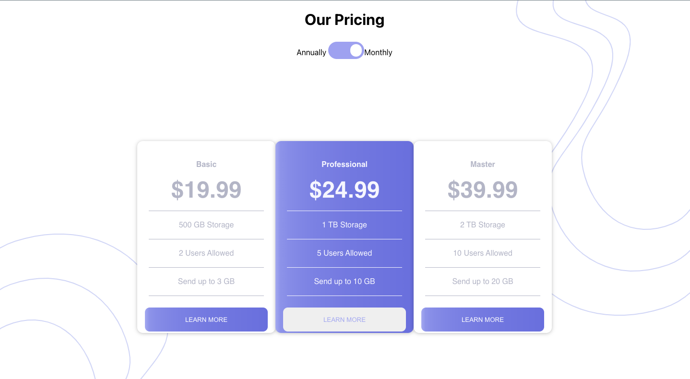

# Building a React Pricing Component

## Here is what you'll recreate

---

### Requirements

1. Install [Node](https://nodejs.org/en/download/) and [git](https://github.com/git-guides/install-git).

### Starting the project

1. You can use `npm create-react-app <appName>` or `npx create-react-app <appName> to build this project from scratch,

OR

2. You can clone this [starter code](https://github.com/MyNameIsJohnson/pricing-component).

   - Open your terminal and type `git clone https://github.com/MyNameIsJohnson/pricing-component.git `

   - Once cloned, `cd` into your project

   - Type in the terminal, `npm install`. This will install the dependecies need to run your project

   - Once dependencies have been installed, run `npm start`

Expect to see:

---

3. The Toggle switch is a stretch goal. Once you get the contents rendered and style close enough and would like to tackle it, have at it.

### Style options

- font family: 'Montserrat', sans-serif;
- background image: url('../public/images/bg-top.svg'), url('../public/images/bg-bottom.svg');

- Light blue: hsl(234, 14%, 74%);

- linear-gradient(.25turn, hsl(236, 72%, 79%), 10%, hsl(237, 63%, 64%));
